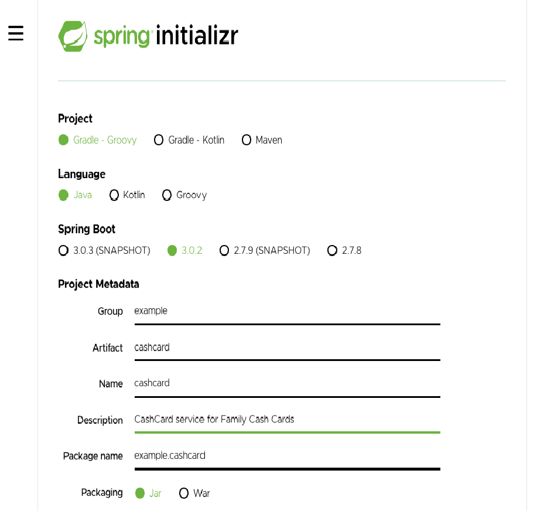
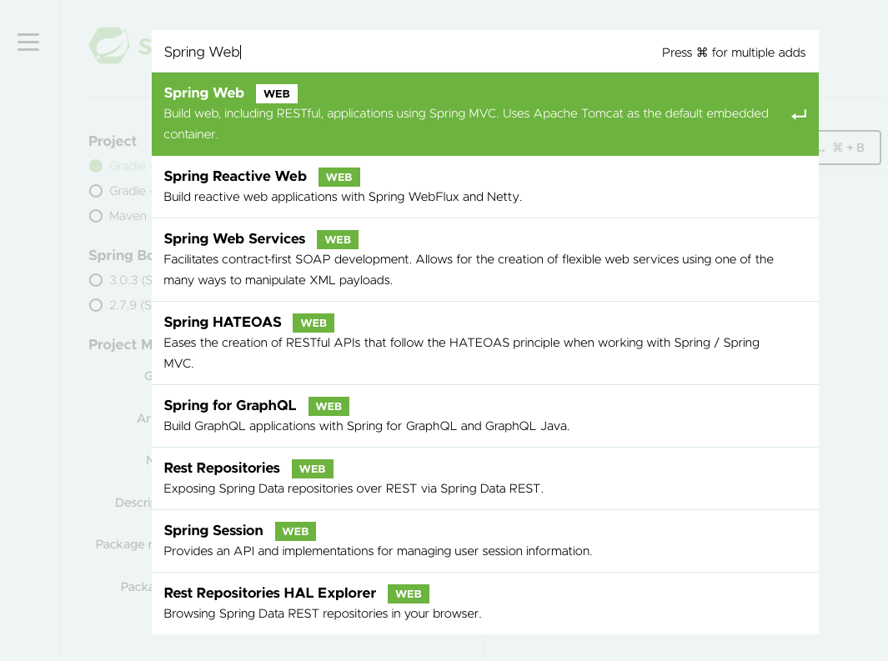

Lab: Spring Initializr
======================

Complete the following steps to use Spring Initializr to set up the Family Cash Card REST API application.

1. Open **Spring Initializr** in web browser: `https://start.spring.io/`

    

2. Select the following options:

    Project: **Gradle - Groovy**
    
    Language: **Java**

    SpringBoot: **Choose the latest 3.0X version**

3. Enter the following values next the corresponding Project Metadata fields:

    Group: `example`

    Artifact: `cashcard`

    Name: `CashCard`

    Description: `CashCard service for Family Cash Cards`

    Packaging: `Jar`

    Java: `17`

**Note:** You do not have to enter the "Package name" field -- Spring Initializr will fill this in for you!

4. Select the **ADD DEPENDENCIES...** button from the **Dependencies** panel.

5. Select the following option, since we know that we will be creating a web application:

    Web options: **Spring Web**

Later on in the course, you will be adding additional dependencies without using Spring Initializr.



6. Click the **GENERATE** button. Spring Initializr generates a zip file of code and download it.

7. **Note** run the below command in your terminal to download above project.

```
curl -o 'cashcard.zip' 'https://start.spring.io/starter.zip?type=gradle-project&language=java&dependencies=web&name=CashCard&groupId=example&artifactId=cashcard&description=CashCard+service+for+Family+Cash+Cards&packaging=jar&packageName=example.cashcard&javaVersion=17' && unzip -d 'cashcard' 'cashcard.zip'
```
 
8. From the command line in the Terminal tab, enter the following commands to use the gradle wrapper to build and test the generated application.

Go to the cashcard directory in the Terminal dashboard tab.

```
[~] $ cd cashcard
[~/cashcard] $ 
```

Next, run the `./gradlew build` command:

`[~/cashcard] $ ./gradlew build`

The output shows that the application passed the tests and was successfully built.

```
Downloading https://services.gradle.org/distributions/...`

...10%...20%...30%...40%...50%...60%...70%...80%...90%...100%

> Task :test
2022-10-26 20:41:09.313  INFO 329 --- [ionShutdownHook] com.zaxxer.hikari.HikariDataSource       : HikariPool-1 - Shutdown initiated...
2022-10-26 20:41:09.317  INFO 329 --- [ionShutdownHook] com.zaxxer.hikari.HikariDataSource       : HikariPool-1 - Shutdown completed.

BUILD SUCCESSFUL in 45s
7 actionable tasks: 7 executed
```


#### Summary
Congrats! You’ve just learned how to quickly and easily bootstrap a Spring Boot codebase using Spring Initializr.